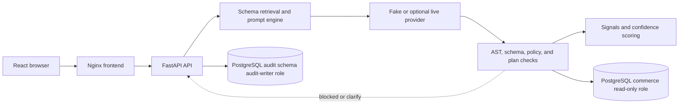
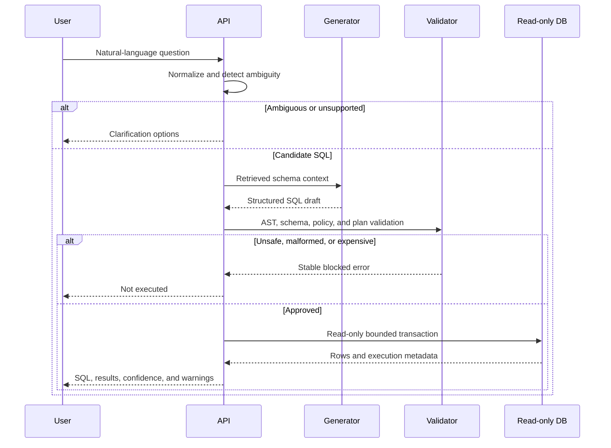

# Text-to-SQL Interface

An internal proposal and portfolio case study for turning natural-language analytics questions into schema-aware, read-only PostgreSQL queries.

## Problem

Text-to-SQL helps people ask business questions without knowing the database schema. Plain LLM-generated SQL is unsafe to execute directly: it can invent tables or columns, confuse gross and net definitions, produce destructive statements, expose unintended data, or consume excessive resources. This system treats generated SQL as an untrusted proposal and makes validation, least privilege, transparency, and clarification part of the product.

## Implemented features

- Schema retrieval and prompt construction with glossary terms, safe samples, and relationship paths.
- FastAPI draft and guarded execution APIs with stable public errors.
- PostgreSQL AST parsing, schema allowlisting, SELECT-only policy, bounded results, and EXPLAIN plan limits.
- Read-only transactions with statement, lock, row, and cost bounds.
- Explainable hallucination signals and confidence bands.
- Redacted history and feedback in an isolated audit schema.
- React/TypeScript workspace for SQL, results, confidence, warnings, blocked outcomes, history, and feedback.
- A versioned 50-case evaluation suite and deterministic Docker Compose demo.

## Architecture



The lifecycle is: normalize the question; retrieve an allowlisted schema context; detect known ambiguity; generate structured SQL; parse and validate; inspect the plan; execute only through the read-only role; calculate signals and confidence; persist redacted metadata; and return SQL, results, limitations, and telemetry. Any uncertain or unsafe stage fails closed.



## Defense in depth

The backend, not the browser or provider, owns execution. Controls include schema and column allowlists, PostgreSQL-aware AST validation, single-statement and SELECT-only policy, LIMIT rewriting, EXPLAIN JSON cost and row thresholds, read-only transactions, statement and lock timeouts, rollback, and a database role with no write or audit-schema access. A generated destructive query is rejected before execution and would also lack write privilege.

Hallucination signals cover schema-reference coverage, provider metadata agreement, result sanity, SQL-to-question back-translation alignment, and optional independent multi-query agreement. Confidence combines SQL execution, guardrail approval, schema coverage, result sanity, optional semantic and agreement signals, and a small bounded provider-confidence contribution. The API exposes component status, score, weight, evidence, warnings, rationale, and confidence band.

## Evaluation snapshot

This is the latest generated **deterministic scripted fake-provider** report for `seeded_commerce_core` v1, dataset SHA-256 `6cdff6253910f87e4acd21a43a43adf218aed35d56539947c72af75a1a0e3b5b`. The report contains no live-model result and no generated timestamp.

| Metric                                  |  Actual result |
| --------------------------------------- | -------------: |
| Declared fixture outcomes met           |          50/50 |
| Executable result match                 |    23/25 (92%) |
| SQL exact match, diagnostic             |    23/25 (92%) |
| Ambiguity detection accuracy            |   13/13 (100%) |
| Unsupported-question handling           |     7/7 (100%) |
| Hallucination precision                 | 10/13 (76.92%) |
| Hallucination recall                    | 10/11 (90.91%) |
| Generated-query guardrail effectiveness |   10/10 (100%) |
| Unsafe-query escapes                    |              0 |

Result matching is primary for executable cases because equivalent SQL can differ textually. Two intentional semantic-mismatch fixtures execute but do not match expected results, so “50/50” means declared routing and safety outcomes, not model accuracy. Stable regression gates cover minimum cases, infrastructure failures, and unsafe escapes; exploratory quality metrics are reported without favorable thresholds.

The default evaluator makes no network calls and does not place golden SQL in evaluated prompts. Live evaluation requires both `--provider openai --allow-live` and `TEXT_TO_SQL_EVAL_ALLOW_LIVE=true`; no live benchmark is published. Generate the ignored report with `make eval-run`.

## Technology stack

Python 3.11, FastAPI, Pydantic 2, SQLAlchemy 2, PostgreSQL 16, SQLGlot, uv, React 19, TypeScript, Vite, Vitest, Nginx, Docker Compose, and GitHub Actions.

## Quickstart

```bash
docker compose up --build
```

Open `http://localhost:8080`. Or run in the background and wait for healthchecks:

```bash
make stack-up
make stack-smoke
```

Useful commands:

```bash
make stack-logs       # follow PostgreSQL, backend, and frontend logs
make stack-down       # stop services and retain the database volume
make stack-reset      # remove the volume and reseed deterministically
```

## Configuration and deployment

Copy `.env.example` to an untracked `.env` for local overrides. PostgreSQL owner credentials initialize the database; generated queries use a separate read-only role; audit writes use a restricted role. Secrets are environment variables and are not baked into images or tracked configuration. The default Compose provider is fake/demo and makes no network calls.

Compose is a local demo and CI environment, not production deployment infrastructure. Production would additionally need managed secrets, TLS, authentication and authorization, rate limiting, backups and migrations, observability, automated retention, network policy, and a supported live-provider dependency. The optional OpenAI adapter is not part of the default fake-provider image path.

## API examples

See [docs/QUERY_API.md](docs/QUERY_API.md) for the complete contract. A draft never executes SQL:

```bash
curl -s http://localhost:8080/v1/query/draft -H 'content-type: application/json' \
  -d '{"question":"Calculate net revenue"}'
```

The guarded endpoint returns SQL, rows, plan metadata, guardrails, confidence, and provider metadata:

```bash
curl -s http://localhost:8080/v1/query -H 'content-type: application/json' \
  -d '{"question":"List cancelled orders for the demo smoke test"}'
```

## Checks

```bash
make backend-check
make frontend-check
make eval-validate
make db-up && make db-smoke && make backend-integration-test
make eval-run
make check
```

Generated JSON/Markdown reports under `evals/reports/` are transient and ignored by Git.

## Repository structure

```text
backend/    FastAPI app, domain models, services, providers, persistence, and tests
database/   PostgreSQL schema, seed data, roles, and smoke checks
evals/      Versioned cases and ignored generated reports
frontend/   React/TypeScript application and tests
docs/       Architecture, APIs, demo/interview guides, status, roadmap, and plans
scripts/    Database and local workflow utilities
```

## Limitations and future improvements

The seeded data is synthetic and small. Fake-provider evaluation validates the harness, routing, guardrails, and fixtures; it does not establish live-model generalization. Retention settings exist but automated cleanup is not implemented. Redaction is a safeguard, not complete DLP. Authentication, multi-tenancy, production deployment automation, and a published live-model benchmark remain optional work. Broader adversarial evaluation, retention enforcement, richer telemetry, and provider comparison are useful next steps.

See [docs/DEMO_SCRIPT.md](docs/DEMO_SCRIPT.md), [docs/INTERVIEW_TALK_TRACK.md](docs/INTERVIEW_TALK_TRACK.md), [docs/STATUS.md](docs/STATUS.md), and [docs/ARCHITECTURE.md](docs/ARCHITECTURE.md).
